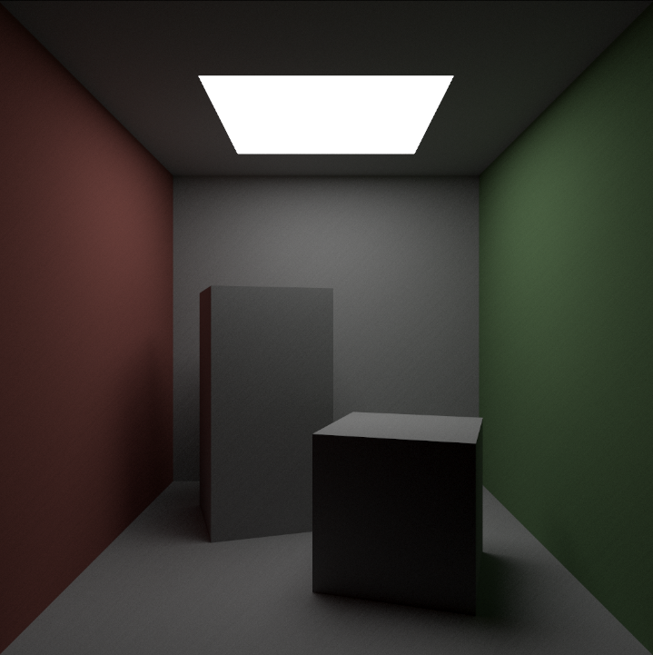
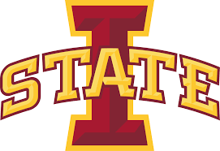

# Hybrid Relightable 3D Gaussian Rendering README  
Team 40 – Senior Design May 2025  
Jackson Vanderheyden (Graphics Scope Manager), Brian Xicon (Machine Learning Scope Manager), Luke Broglio (Schedule Manager), Ethan Gasner (Documentation Manager), Kyle Kohl (Communication Manager), <br>  
| [Project Page](https://sdmay25-40.sd.ece.iastate.edu/)| [Demo Video (coming soon)](#) | [Final Report (coming soon)](#) | [Unity Plugin (WIP)](#) |<br>  


This repository contains the official implementation of our senior design project **Hybrid Relightable 3D Gaussian Rendering**, which enables high-quality 3D models to be reconstructed from video using AI. Our system converts video into realistic, relightable 3D Gaussian models that can be seamlessly used within the Unity Game Engine. Users can place and transform these models alongside Unity-supported objects, enabling intuitive scene authoring.


---


## Abstract  
*We present a novel hybrid pipeline for generating relightable 3D Gaussian splats from video. Built on Unity Editor Version 2022.3.50f1, our system combines classical Structure-from-Motion with gaussian optimization using a neural network in PyTorch. The output is a scene of 3D Gaussians that can be rendered in real time in Unity with custom lighting setups. This enables realistic asset creation from everyday footage for use in games, film, AR/VR, and rapid prototyping.*


---
## Prerequisites before use: 
### Software Requirements:
```
    Must have Unity installed on your computer.
    Must have Python 3.10+
    Must have the Colmap libary installed 
```
### Hardware Requirements:
```
    Must have an Nvidia's graphics card in your computer.
```


## Installation

### 1. Install Python
Follow your OS instructions or [download Python 3.10+ from the official site](https://www.python.org/downloads/).  
Add Python to PATH during installation.


### 2. Install Colmapy
Run this command in your terminal.
```
pip install pycolmap
```
This creates a python binding to use with your project. 

### 3. Install BLANK
Are there anything else we need to install

---


## Pipeline Overview


```
graph TD
A[Video] --> B[COLMAP SfM + MVS]
B --> C[Initial Point Cloud]
C --> D[Gaussian Scene Optimization (PyTorch)]
D --> E1[Unity Ray Tracer]

```


---


## Features


-  Convert video into a full 3D scene
-  Relightable Gaussian-based scene rendering
-  Unity-compatible real-time ray tracer
-  Seamless Structure-from-Motion integration


---
## File Structure
//Picture of our file Structure

## Usage

```
1) Start a new Unity project
2) Add our project as a Unity Asset from the Unity Asset Store. There is a link below. 
1) Take the video files you desire to turn into a 3D model and drag them to the BLANK folder in the unity project folder.
3) Hit play in Unity, this may take a while depending on the length of your video. The generated 3D model should be outputted to the BLANK folder. 
4) ANY Other instructions for Running our project.
```
Link for our project in the [Unity Asset Store](Stuff)

## Known Issues
The runtime of generateing a 3D model make take a while due to your computer hardware and the length of your viedo. 


## BibTeX


```bibtex
@misc{team40_gaussian_2025,
  title={Hybrid Relightable 3D Gaussian Rendering},
  author={Senior Design Team 40,Jackson Vanderheyden, Brian Xicon, Luke Broglio, Ethan Gasner, Kyle Kohl },
  year={2025},
  note={Iowa State University Senior Design Project}
}
```


---


## Acknowledgements


Special thanks to Dr. Mitra for guidance, the ECE Department at Iowa State University, and the authors of [3D Gaussian Splatting (Kerbl et al.)](https://repo-sam.inria.fr/fungraph/3d-gaussian-splatting/) for inspiration.

<a href="https://www.ece.iastate.edu/"></a>
<a href="https://www.iastate.edu/"></a>
---
