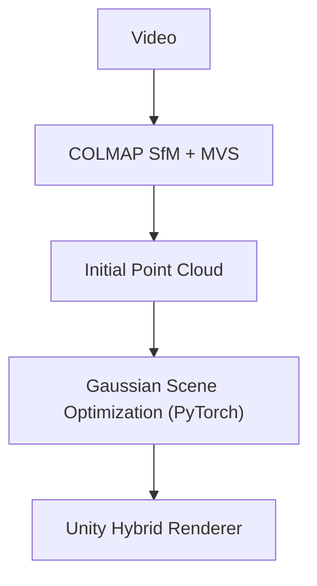

# Hybrid Relightable 3D Gaussian Rendering README  
Team 40 – Senior Design May 2025  
Jackson Vanderheyden (Graphics Scope Manager), Brian Xicon (Machine Learning Scope Manager), Luke Broglio (Schedule Manager), Ethan Gasner (Documentation Manager), Kyle Kohl (Communication Manager), <br>  
| [Project Page](https://sdmay25-40.sd.ece.iastate.edu/)|<br>  


This repository contains the official implementation of our senior design project **Hybrid Relightable 3D Gaussian Rendering**, which enables high-quality 3D models to be reconstructed from video using AI. Our system converts video into realistic, relightable 3D Gaussian models that can be seamlessly used within the Unity Game Engine. Users can place and transform these models alongside Unity-supported objects, enabling intuitive scene authoring.


---


## Abstract  
*We present a novel hybrid pipeline for generating relightable 3D Gaussian splats from video. Built on Unity Editor Version 2022.3.50f1, our system combines classical Structure-from-Motion with gaussian optimization using a neural network in PyTorch. The output is a scene of 3D Gaussians that can be rendered in real time in Unity with custom lighting setups. This enables realistic asset creation from everyday footage for use in games, film, AR/VR, and rapid prototyping.*


---


## Prerequisites before use: 
### Software Requirements:
- Must have Python 3.10+
- Must have the plyfile libary installed 
- Must have the ipython libary installed 
- Must have the torch libary installed 
- Must have Unity installed on your computer.

### Hardware Requirements:
- Must have an NVIDIA graphics card capable of running CUDA for optimizing 3D Gaussians.


## Installation
### 1. Install Python
Follow these [instructions](https://phoenixnap.com/kb/how-to-install-python-3-windows) for Windows.  

Follow these [instructions](https://phoenixnap.com/kb/install-python-mac)  for Mac.  

1. Download [Python Executable Installer](https://www.python.org/downloads/)
1. Run Executable Installer
1. Add Python to PATH during installation
1. Verify Python is installed on Windows
1. Verify pip is installed on Windows


### 2. Install Colmap
Run this command in your terminal:
```
pip install pycolmap 
```

### 3. Install AI dependencies
Run this command in your terminal:
```
pip install plyfile ipython torch
```

---


## Pipeline Overview



---


## Features

-  Seamless Structure-from-Motion integration
-  Convert video into a fully modeled 3D scene
-  Hybrid Triangle-Gaussian-based scene rendering
-  Unity-compatible real-time ray tracer


---


## File Structure
```
Assets/
└── Hybrid Relightable 3D Gaussian Rendering/        
    ├── Scripts/
    ├── Prefabs/
    ├── Materials/
    ├── Textures/
    ├── Scenes/
    └── Documentation/
```


## Usage

1. Start a new Unity project
1. Add our project as a Unity Asset from the [Unity Asset Store.](https://assetstore.unity.com/?srsltid=AfmBOopmn0X6VALSruZEQJMtL-55UQVQts2TmAIOy4t4K6ZpyPE9UVjZ)
1. Hit play in Unity, this may take a while depending on the length of your video. The generated 3D model should be outputted to the ouput folder. 
1. When prompted, select the video files you desire to turn into a 3D model.
1. The progress of the render is outputed to the Unity Console. 


## BibTeX

```bibtex
@misc{team40_gaussian_2025,
  title={Hybrid Relightable 3D Gaussian Rendering},
  author={Senior Design Team 40, Jackson Vanderheyden, Brian Xicon, Luke Broglio, Ethan Gasner, Kyle Kohl},
  year={2025},
  note={Iowa State University Senior Design Project}
}
```
---


## Acknowledgements

Special thanks to Dr. Mitra for guidance, the ECE Department at Iowa State University, and the authors of [3D Gaussian Splatting for Real-Time Radiance Field Rendering (Kerbl et al.)](https://repo-sam.inria.fr/fungraph/3d-gaussian-splatting/), [Relightable 3D Gaussian](https://nju-3dv.github.io/projects/Relightable3DGaussian/), and [3D Gaussian Ray Tracing of Particle Scenes](https://gaussiantracer.github.io/) for inspiration.

<a href="https://www.ece.iastate.edu/"></a>
<a href="https://www.iastate.edu/"></a>
---